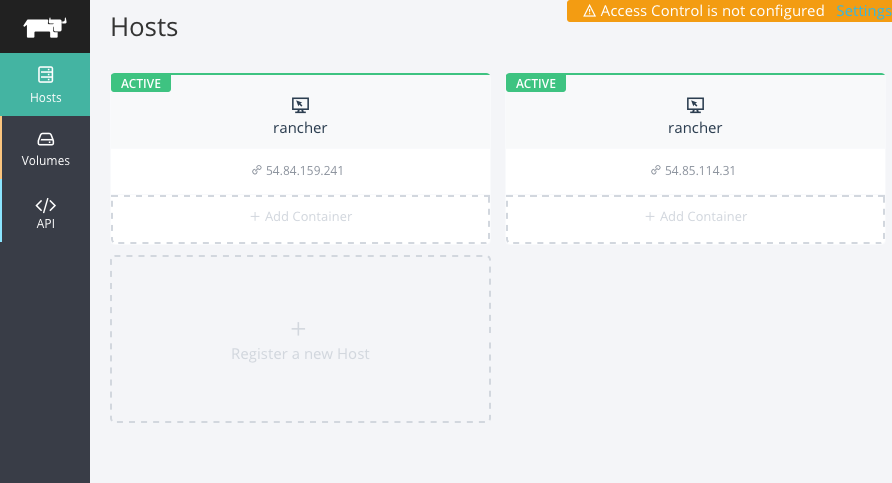

Ansible Playbook to start a [Rancher](https://github.com/rancherio/rancher) cluster on AWS with rancherOS instances
===================================================================================================================

[Rancher](https://github.com/rancherio/rancher) is a new multi-host Docker management platform.
It consists currently of single master node and a set of worker running Docker. The agent running in the worker nodes runs as a Docker container.
Rancher builds a network overlay to allow cross-hosts container linking. It has a nice dashboard as well as a programming API and integrates with GitHub for Authentication and Authorization.

[Rancher Labs](http://rancher.com) recently announced [RancherOS](https://github.com/rancherio/os) which brings just enough OS to run Docker. It fits in the same realm as coreOS, Ubuntu Snappy and project Atomic. Starting with RancherOS is easy with the [vagrant](https://github.com/rancherio/os-vagrant) project.

It's pretty certain that Rancher labs will use its own software and run Rancher on rancherOS.

This is an attempt at providing an ansible playbook to start a set of instances on EC2 using rancherOS and deploying Rancher on them.

It should be as easy as:

    $ git clone https://github.com/runseb/ansible-rancher.git
    $ cd ansible-rancher
    $ ansible-playbook rancher.yml

Once the playbook finishes, you will see the IP of the master. Open your browser at `http://<IP_OF_MASTER>:8080` and enjoy the UI.

Of course you will need to have Ansible installed:

    $ sudo pip install ansible

You will need an account on AWS, and some API keys properly setup for use with Ansible. Couple Google searches away.

The playbook is simple. It creates a keypair and a security group. The main play can be edited to set the number of nodes etc:

    hosts: localhost
      connection: local
      vars:
        ssh_key: rancher
        aws_region: us-east-1
        num_nodes: 5
        security_group_name: rancher
        template: ami-eeaefc86 
        instance_type: m1.small

      roles:
        - common
        - rancher

Note that in the inventory I specify a python interpreter for my localhost, that's because I use OSX. Remove it on linux.

    [default]
    localhost ansible_python_interpreter=/opt/local/Library/Frameworks/Python.framework/Versions/2.7/bin/python

Caveats
-------

During this testing, I encountered a few issues with rancherOS.

* The cloud-init support is still WIP and it seems to be conflicting with AWS userdata.
So if you pass both a keypair and userdata in the `roles/rancher/tasks/create_vm.yml` the keypair access gets disabled.
Therefore comment the userdata lines if you want to be able to ssh into your instance. ticket opened [#66](https://github.com/rancherio/os/issues/66)
* Everything is docker in rancherOS, so there is no python, minimal unix commands and most the filesystem is readonly. This means that running ansible adhoc commands will fail, until we can boostrap the instances with some form of python. Something like [this](https://github.com/defunctzombie/ansible-coreos-bootstrap) but not quite.
* The AMI for rancherOS are only available in US zones. ticket opened [#65](https://github.com/rancherio/os/issues/65)
* The UI is a bit slow to start, so wait ~5 minutes.
* Auto registration of workers using my own crude userdata way is not working yet.

